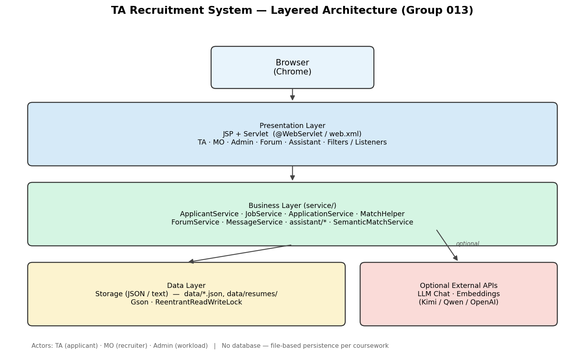

# EBU6304 Software Engineering Group Project

## 2025-26

**Group number:** 013

| Member | QM no. | Name | Primary responsibility |
|:------:|:------:|:-----|:------------------------|
| member 1 | 231221674 | Dingyi Zhang | Web / Controller — Servlets, URLs, session, filters/listeners, deployment; partial prototype design |
| member 2 | 231220286 | Kuozhi Guo | GUI — JSP, CSS, page interaction |
| member 3 | 231221124 | Yuwei Zhang | Business logic — `Service` layer, rules, algorithms |
| member 4 | 231221168 | Bingrui Liu | Documentation & requirements — SRS/use cases, PRD, README, reports |
| member 5 | 231221179 | Zhuoran Wang | Data — models, JSON, `Storage`, data-file conventions |
| member 6 | 231220954 | Wenbo Dang | Testing — test cases, execution, regression, acceptance checklist |

# Final short report

**Document structure (per coursework template)**

| Part | Sections | Page limit |
|------|----------|------------|
| **I — Group report** | System overview, Design, Implementation, Testing, GenAI | **Maximum 10 pages** (includes tables, Figure 1, and other diagrams in this part only) |
| **II — Individual contribution** | Six members: main contribution + reflective statement each | Not counted in the 10 pages (≤300 words per member, both paragraphs combined) |

---

## Part I — Group report (maximum 10 pages)

*The subsections below through GenAI form the graded group report. Stop counting pages at the end of GenAI.*

### System overview and functional description

### Purpose

The **BUPT International School TA Recruitment System** is a lightweight web application that replaces spreadsheet-based TA hiring with a single platform for job posting, applications, screening, communication, and workload oversight. It targets teaching/demo use: Servlet/JSP, JSON file storage, bilingual UI (Chinese/English), and optional AI features that remain **explainable** and under human control.

### Roles and main functions

| Role | Main capabilities |
|------|-------------------|
| **TA (applicant)** | Register/login; maintain profile and skill tags; upload/edit CV (txt, pdf, docx); browse and filter open jobs; apply once per job; track status (`pending` → `interview` → `accepted` / `rejected` / `cancelled`); confirm or reschedule interviews; forum; direct messages; optional AI assistant for CV/process help |
| **MO (module organiser)** | Register/login; post/edit/close jobs (course TA, invigilation, events, etc.); view applicants per job with **match score**, **matched skills**, and **skill gaps**; schedule interviews; hire or reject; aggregate match statistics (mean, median, score buckets); messages and forum |
| **Admin** | Login; global view of TA **workload** (accepted assignments per person, avg/min/max, high/low hints); expand per-TA job list; cancel or **transfer** accepted assignments to balance load (with operational caveat in README) |
| **Visitor** | Home, forum read, language switch; sign-in required for apply/post/DM |

**Cross-cutting:** `/personal-center` role routing; forum; friend links and friend requests; DM with read state; `LocaleFilter` i18n; session timeout (30 min); password hashing (`PasswordUtil`).

### End-to-end recruitment flow

1. MO publishes a job with title, description, type, and **required skills**.  
2. TA finds the job, submits an application (optional note).  
3. MO opens **Job applicants**: system ranks candidates by match score and lists gaps.  
4. MO may set **interview**, then **accept** or **reject**; TA responds to interview slots.  
5. Accepted rows feed **admin workload**; admin may rebalance assignments.  
6. All state is persisted in JSON under `data/` (no database).

### Skill matching and AI-assisted algorithms

Matching supports MO screening (“who fits this job?”) and is implemented in `MatchHelper`, `SkillExtractor`, and optionally `SemanticMatchService`.

**Step 1 — Candidate skill set (rule-based extraction)**  
- **Profile skills:** tags stored on the applicant record.  
- **Résumé skills:** `SkillExtractor` scans plain-text CV against the job’s required-skill list using **synonym maps** (e.g. Java/JDK, Python/py, Communication/沟通) and **word-boundary rules** (Latin tokens use `\b`; Chinese phrases use substring match).  
- These sets are unioned before scoring.

**Step 2 — Rule match score (0–100, default and always available)**  
- If the job has no required skills → score **100**.  
- Otherwise: **score = (number of required skills found in candidate set / total required) × 100**.  
- **Skill gaps** = required skills not present in profile + résumé extraction (shown to MO; not auto-reject).

**Step 3 — Optional semantic score (embeddings, off by default)**  
- When `match.semantic.enabled=true` and API keys are configured, `SemanticMatchService` builds text from applicant skills + résumé and from job title/description/skills, calls an **OpenAI-compatible embeddings** endpoint (Kimi / Qwen / OpenAI per config), and computes **cosine similarity** → 0–100 via `VectorUtil`.  
- Vectors are cached in `data/embeddings.json` (keyed by entity id + model) to avoid repeat API cost.

**Step 4 — Fusion (hybrid score)**  
- If semantic score is unavailable → final score = **rule score only** (fully deterministic, suitable for viva/demo without API).  
- If both exist → weighted blend: default **50% rule + 50% semantic**; weight shifts to **80% semantic** when rule &lt; 30 and semantic &gt; 70 (résumé implies hidden fit), or **20% semantic** when rule &gt; 70 and semantic &lt; 30 (trust explicit tags).  
- MO UI still shows **gaps** from rule logic so results stay interpretable.

**Step 5 — Ranking and job-level stats**  
- `recommendApplicantsForJob` sorts applicants by final score descending.  
- `computeJobMatchStats` gives MO cohort **average, median, min/max**, score histogram buckets, and top collective gaps/strengths.

**Intelligent assistant (separate from match score)**  
- `/assistant` uses **chat completions** (not embeddings) for Q&A and CV wording, guarded by `AssistantScopeGuard` (recruitment/site topics only). Optional quota/WeChat pay. Documented further under **GenAI** below.

### Functional scope summary

| Area | Implemented highlights |
|------|-------------------------|
| Core hiring | Auth, jobs, applications, interview, hire/reject, status tracking |
| AI / matching | Rule + synonym extraction; optional embedding fusion; explainable gaps |
| Social | Forum, DM, friends |
| i18n | zh/en UI toggle |
| Admin | Workload dashboard and assignment adjustment |

---

## Design

We adopted a lightweight **three-tier architecture** aligned with the coursework constraints (Java Servlet/JSP, no database).

**Presentation layer:** JSP views and Servlet controllers, organised by role (TA, MO, Admin) and feature (forum, assistant, personal centre). Examples include `TAAuthServlet`, `MODashboardServlet`, `AdminServlet`, and `ForumServlet`.

**Business layer:** Service classes encapsulate recruitment rules—`ApplicantService`, `JobService`, `ApplicationService`, `MatchHelper`, `ForumService`, `MessageService`, and the `assistant` sub-package for LLM integration.

**Data layer:** A single `Storage` class persists entities as JSON/text under `{webapp}/data/`, using Gson and `ReentrantReadWriteLock` for basic concurrent access safety.

**Actors and flows:** Teaching Assistants apply for jobs; Module Organisers publish jobs and manage applicants; Administrators view workload and may transfer accepted assignments. Application states include `pending`, `interview`, `accepted`, `rejected`, and `cancelled`.

**Cross-cutting concerns:** `AppListener` initialises the data directory; `LocaleFilter` supports bilingual UI; `NoStoreSensitivePagesFilter` reduces back-button exposure after logout; `AssistantConfigListener` loads optional AI configuration.

**Design principles:** Simplicity, modularity, extensibility. Functional behaviour and matching pipelines are summarised in **System overview** above; architecturally, skill matching defaults to **deterministic rules** with optional **semantic fusion** behind the same MO screen. Passwords use **salted SHA-256** (`PasswordUtil`) with legacy hash compatibility.

**Patterns used:** Layered architecture; Front Controller (Servlet mappings); Service layer; Repository-style `Storage`; strategy-like switching between rule-based and embedding-based scores; server-side **scope guard** (`AssistantScopeGuard`) before external LLM calls.

**Figure 1 — System architecture (three-tier + optional AI APIs)**

---

## Implementation

**Strategy:** Incremental delivery over four iterations (Sprints), documented on GitHub with feature branches and pull requests to `master`.

| Iteration | Focus (summary) |
|-----------|-------------------|
| v1 / 1.1 | Core TA/MO auth, jobs, applications, JSON persistence |
| v2.0–2.1 | Forum, DMs, friends, personal centre, assistant (initial) |
| v2.2 | Mock data for demo and manual testing |
| v2.3 | Bilingual UI (i18n bundles, `LocaleFilter`) |
| v4+ | Admin workload transfer, password salting, resume skill extraction + semantic match fusion |

**Build:** Maven builds `ta-recruitment.war` (Java 11). Stack: Servlet 4.0, JSP, JSTL, Gson, PDFBox, POI. Run locally with `mvn tomcat7:run` (port 8082) or deploy WAR to Tomcat `webapps/`.

**Configuration:** AI keys and feature flags in `assistant.properties` or environment variables (`ASSISTANT_PROPERTIES_PATH`, provider API keys, `MATCH_SEMANTIC_ENABLED`).

**Version control:** GitHub is the collaboration hub. Members use named branches and integrate via pull requests. Work was split by layer: data (models/`Storage`), services (rules and matching), web layer (Servlets, filters, deployment), presentation (JSP/CSS), testing, and documentation—see individual statements below.

**Team build plan (agreed division):**

| Area | Scope | Owner (QM no.) |
|------|--------|----------------|
| Web / Controller | Servlets, URL mapping, session, `web.xml`, filters/listeners, deployment; partial prototype design | Dingyi Zhang (231221674) |
| GUI | JSP views, `css/`, bilingual UI and interaction | Kuozhi Guo (231220286) |
| Business logic | `service/*`, recruitment rules, skill matching algorithms | Yuwei Zhang (231221124) |
| Docs & requirements | SRS/use cases, PRD, README, reports, backlog | Bingrui Liu (231221168) |
| Data | Domain models, JSON persistence, `Storage`, `data/` files | Zhuoran Wang (231221179) |
| Testing | Test cases, manual/regression runs, pre-release checks | Wenbo Dang (231220954) |

**Core delivered functions:** TA register/login, profile, resume upload (txt/pdf/docx), job browse/apply, application status; MO post/manage jobs, applicant list with match % and skill gaps, hire/reject/interview; Admin workload view and transfer; forum and messaging; optional intelligent assistant and semantic match.

---

## Testing

**Strategy:** Manual **black-box** testing with a formal test-case document, suitable for a teaching prototype without a project-wide JUnit suite.

**Techniques:** Equivalence classes and boundary values for login; positive/negative application paths; file-type validation for resumes; role-based access control; regression after each sprint merge.

**Documentation:** `助教招聘系统_测试用例文档_v1.docx` (detailed cases); `测试用例说明.md` (Group 013 summary).

**Environment:** Windows/macOS, Chrome, Java 11, Maven, Tomcat; persistence via JSON under `data/`.

**Scope:** Authentication; role dashboards; job application; personal centre; resume upload/extract/download; forum/social; data persistence.

**Example results:**

1. **Login:** Valid TA/MO credentials → role dashboard; invalid password → error; empty fields → validation; unauthenticated access to `/ta/dashboard` → redirect to auth.
2. **Applications:** First apply succeeds; duplicate apply for same job blocked; MO sees applicant with match score and missing skills aligned with `MatchHelper`.
3. **Resume:** Valid `.txt` stored under `data/resumes/`; empty upload rejected; PDF/Word text extraction via `ResumeTextExtractor` / assistant API.
4. **Admin:** `/admin/workload` requires admin session; counts match `applications.json` accepted records.

**Limitations:** No automated unit tests in repo; limited load/concurrency testing; AI-assisted features need manual verification when enabled.

---

## The use of Generative AI (GenAI)

### Development (off-line)

Tools such as **Cursor** and general LLMs assisted brainstorming, user-story drafting, JSP/CSS snippets, Servlet boilerplate, debugging, and README/PRD writing. All outputs were **reviewed and adapted** to our package layout (`com.bupt.ta`), session attributes, and `Storage` APIs. Team members can explain what AI suggested and how it was changed (required for viva).

### Product (runtime)

| Feature | Description |
|---------|-------------|
| Intelligent assistant | `/assistant`, REST `/api/assistant/chat`, `/api/assistant/extract-resume`; providers Kimi/Qwen/OpenAI (OpenAI-compatible) |
| Skill matching | Rule-based default; optional embeddings via `SemanticMatchService` |
| Scope guard | `AssistantScopeGuard` blocks off-topic/sensitive prompts before upstream calls |
| Quota / pay | `AssistantQuotaService`; optional WeChat Native pay—logic remains in Java, not blind model trust |

### Effectiveness

- Faster UI and documentation iteration.
- Embeddings improve paraphrased skill matching when configured.
- Rule-based matcher remains the **explainable baseline** for demonstrations.

### Limitations

- Models may invent policies or dates → mitigated by scope guard and static UI text.
- Privacy: resume/job text sent to third parties only when chat or semantic match is enabled.
- Non-deterministic scores require human judgment by MO.
- Course **demo video** must use live operation and human English narration—no post-edited or AI-generated video content.
- Generic AI code often misses session checks or locking—we added `Storage` locks and role checks in review.

---

**— End of Part I (Group report). The 10-page limit applies to content above this line only. —**

\pagebreak

# Part II — Individual contribution and reflection

*Not included in the 10-page group report limit. Each member: maximum 300 words total for **Main contribution** and **Reflective statement** combined.*

---

## Member 1 — Dingyi Zhang (Web / Controller)

**QM no:** 231221674  
**Name:** Dingyi Zhang

**Main contribution:**  
Owned the **web/controller layer**: Servlets under `web/` (TA/MO/Admin auth and dashboards, job applicants, forum, assistant APIs), URL design, `HttpSession` usage, request parameters and JSP forwarding. Configured `web.xml`, `LocaleFilter`, `NoStoreSensitivePagesFilter`, `AppListener`, and assistant config listeners. Drove **deployment and integration** (`mvn package`, Tomcat WAR, port/context troubleshooting) so the team could run a single deployable build. Contributed to **low/medium-fidelity prototype** ideas aligned with backlog stories.

**Reflective statement:**  
Integration—not individual classes—was often the hardest part (context path, session attributes, filter order). Coordinating with GUI and service owners via GitHub PRs mirrored real Agile handoffs. I improved skills in tracing HTTP flows and documenting URLs for README and demos.

---

## Member 2 — Kuozhi Guo (GUI)

**QM no:** 231220286  
**Name:** Kuozhi Guo

**Main contribution:**  
Responsible for **presentation**: JSP pages (`ta/`, `mo/`, `admin/`, `forum/`, `assistant.jsp`, home and personal-centre gates), shared **`css/style.css`** and assistant styles, and page-level interaction (forms, tabs, tables for applicants and workload). Implemented **bilingual UI** with JSTL/`I18n` and language switch links. Ensured role-specific dashboards and error messages are readable and consistent across TA, MO, and Admin journeys.

**Reflective statement:**  
Balancing Chinese and English layouts required early agreement on keys in `messages_*.properties`. Reusing CSS variables kept the UI cohesive. Feedback from testing (e.g. login validation, mobile-width headers) led to iterative polish before intermediate and final demos.

---

## Member 3 — Yuwei Zhang (Business logic)

**QM no:** 231221124  
**Name:** Yuwei Zhang

**Main contribution:**  
Led **business logic** in `service/`: applicant/job/application flows, `MatchHelper` and `SkillExtractor` for rule-based skill match and gap analysis, optional `SemanticMatchService`, and related helpers (`ApplicantService`, `JobService`, `ApplicationService`, `ForumService`, `MessageService`, etc.). Defined application status rules (`pending`, `interview`, `accepted`, `rejected`, `cancelled`) and MO hire/reject behaviour. Iterated on resume skill extraction (synonyms, regex boundaries) and integration with matching scores.

**Reflective statement:**  
I learned to keep algorithms explainable for demos while allowing optional AI enhancement. Trade-offs between keyword matching and embeddings were discussed with the team. Debugging cross-service state (e.g. hire → workload) improved my understanding of end-to-end recruitment workflows.

---

## Member 4 — Bingrui Liu (Documentation & requirements)

**QM no:** 231221168  
**Name:** Bingrui Liu

**Main contribution:**  
Owned **documentation and requirements** not tied to a single code module: product backlog alignment, **`docs/PRD.md`**, SRS/use-case style descriptions, terminology, architecture explanation for reports, **README** (setup, URLs, data files, assistant config), first/intermediate brief reports, and this **final short report** structure. Kept written deliverables consistent with implemented scope and coursework constraints (Servlet/JSP, no DB).

**Reflective statement:**  
Requirements drifted as sprints added forum, assistant, and i18n—documentation had to be updated incrementally. Writing for both markers and teammates improved my ability to separate “shall” requirements from nice-to-have features. Supporting the group report and submission packaging taught me release discipline beyond coding.

---

## Member 5 — Zhuoran Wang (Data)

**QM no:** 231221179  
**Name:** Zhuoran Wang

**Main contribution:**  
Responsible for the **data layer**: domain classes in `model/` (e.g. `Applicant`, `Job`, `Application`), Gson-based JSON persistence in `Storage`, and conventions for files under `data/` (`applicants.json`, `jobs.json`, `applications.json`, forum/messages, resume text files, optional `embeddings.json`). Implemented read–write locking for safe concurrent access, path helpers (`dataPath`, `resumesPath`), and consistency between entity fields and on-disk JSON. Supported other layers by keeping persistence simple and coursework-compliant (no database).

**Reflective statement:**  
Designing file-based storage taught me to think explicitly about schema evolution and backup. The main challenge was avoiding corrupted JSON under parallel requests—solved with locks and clear read/write patterns. I gained confidence in separating persistence from business rules so services stay testable.

---

## Member 6 — Wenbo Dang (Testing)

**QM no:** 231220954  
**Name:** Wenbo Dang

**Main contribution:**  
Led **testing**: authored `助教招聘系统_测试用例文档_v1.docx` and summary `测试用例说明.md` (Group 013). Planned and ran **manual black-box** tests—login, role access, job apply/duplicate apply, profile and resume upload, forum/social modules, JSON persistence checks. Organised **regression** after sprint merges (v2.2 mock data, bilingual build). Prepared **acceptance-style checklists** and pre-release smoke tests for demonstration and viva.

**Reflective statement:**  
Without a mandated JUnit suite, we relied on structured cases and repeatable demo accounts. I learned to trace failures to the right layer (filter vs service vs data). Testing early mock data accelerated MO applicant-list demos and reduced last-minute integration risk.

---

**— End of Part II (Individual contribution). —**
