# 助教招聘系统 · 用户手册

**Group 013 · 北京邮电大学国际学院 · EBU6304**

本手册面向最终用户（应聘者 TA、课程组织者 MO、管理员 Admin），说明如何登录、完成招聘相关操作。各主界面截图均为 **中英双语并排**（左：中文，右：English；页眉或 URL `?lang=zh` / `?lang=en` 切换语言）。

---

## 0. 系统简介

### 0.1 系统能做什么

本系统用于**课程助教、监考、活动支持**等岗位的在线发布与应聘管理，主要能力包括：

- **岗位发布与浏览**：MO 发布岗位，TA 按类型、关键词、技能筛选并申请。
- **简历与技能匹配**：规则打分 + 简历关键词抽取；可选开启 embeddings 语义匹配（见 §3.2、§4.7）。
- **岗位英文书写校验**：MO 发布/编辑岗位时，名称、描述、所需技能须为英文，前后端双重校验（见 §4.3）。
- **申请与面试闭环**：从投递、待审核、面试安排，到录用/拒绝/撤销，状态全程可追踪。
- **沟通协作**：交流论坛、站内私信、好友请求，便于招聘方与应聘者沟通。
- **智能小助手（可选）**：多模型对话、简历上下文、额度与充值、提问范围限制（见 §3.4）。
- **简历工作台**：上传/编辑简历、匹配优势与短板提示、嵌入 AI 润色（见 §3.2）。
- **岗位筛选与匹配度排序**：TA 按关键词、类型、技能筛选，并按匹配分排序（见 §3.3）。
- **面试安排与反馈**：MO 安排面试时间与地点，TA 确认/拒绝/改期（见 §3.3、§4.4）。
- **论坛**：帖子列表、搜索排序、发帖回帖、帖子详情（见 §2.3–§2.4）。
- **站内信与好友**：TA/MO 私信、未读提示、MO 发起好友请求、TA 接受（见 §3.5、§4.5）。
- **多角色注册与个人中心**：TA/MO/Admin 注册、独立个人资料页、资料完整度（见 §3.1、§3.6、§4.6）。
- **工作负荷管理**：管理员统计录用分布、展开明细、转移/取消录用（见 §5.2）。

### 0.2 三类角色分工

| 角色 | 典型用户 | 主要职责 |
|------|----------|----------|
| **应聘者 (TA)** | 学生 | 维护资料与简历、浏览并申请岗位、确认面试、查看申请结果、私信 MO |
| **课程组织者 (MO)** | 教师 / 课程负责人 | 发布/编辑/关闭岗位、查看申请人及匹配度、安排面试、录用或拒绝 |
| **管理员 (Admin)** | 教务 / 项目管理员 | 登录后台查看全局录用与工作负荷，必要时调整已录用分配 |

> **说明**：三类角色使用**独立登录会话**。同一浏览器请勿同时混用多个角色账号，切换角色前请先**退出登录**，否则可能出现跳转异常。

### 0.3 典型业务流程（一览）

```
MO 发布岗位 → TA 浏览并提交申请 → MO 在应聘者列表中筛选（参考匹配分）
    → MO 安排面试 / 直接录用或拒绝
    → TA 在「我的申请」中确认或反馈面试安排
    → 录用结果进入管理员「工作负荷」统计
```

### 0.4 如何阅读本手册截图

- 每张截图**左侧为中文界面**，**右侧为英文界面**，便于对照页眉语言切换效果。
- 截图中的按钮、菜单名称以界面实际显示为准；若与文字描述略有差异，以当前版本界面为准。
- 演示数据（岗位、用户等）来自预置 `data/*.json`，仅用于课程演示，请勿填入真实隐私信息。
- 本手册共 **34 张**中英并排截图（编号 01–34），覆盖认证、工作台各分栏、个人中心、论坛、小助手、管理后台及关键功能弹窗等界面。

### 0.5 全功能清单（按模块）

| 模块 | 功能点 | 主要入口 | 手册截图 |
|------|--------|----------|----------|
| **认证** | TA/MO/Admin 登录、注册、退出、会话 30 分钟 | `/ta/auth`、`/mo/auth`、`/admin/auth`、`* /register.jsp` | 03–05、16、23–24 |
| **TA 资料** | 姓名/学号/手机/技能、资料完整度、独立个人中心 | `/ta/profile` | 17 |
| **TA 简历** | 上传 txt/pdf/doc/docx、编辑文本、下载、匹配优劣势、AI 润色 | 工作台 · 简历 | 07 |
| **TA 岗位** | 列表、关键词/类型/技能筛选、隐藏已申请、匹配度、申请 | 工作台 · 开放岗位 | 08 |
| **TA 申请** | 状态跟踪、撤销、面试确认/拒绝/改期 | 工作台 · 我的申请 | 13 |
| **TA 消息** | 私信 MO、会话列表、未读、好友请求 | 工作台 · 消息 | 14 |
| **MO 岗位** | 发布（英文校验）、编辑、关闭、我的岗位列表 | 工作台 · 发布/我的岗位 | 10、15、19、22 |
| **MO 筛选** | 匹配分、短板、统计分布、排序、面试/录用/拒绝 | `/mo/job-applicants` | 11 |
| **MO 消息** | 私信 TA、未读 | 工作台 · 消息 | 20 |
| **MO 资料** | 组织者个人信息 | `/mo/profile` | 21 |
| **论坛** | 列表、搜索、排序分页、发帖、帖子详情与回复 | `/forum` | 06、18 |
| **小助手** | 对话、简历上传/粘贴、站内简历、额度、充值 | `/assistant` | 09 |
| **管理** | 工作负荷统计、明细、转移录用 | `/admin/workload` | 12 |
| **国际化** | 中英文界面、Cookie 记忆 | 页眉 / `?lang=` | 全部截图 |
| **匹配引擎** | 规则分 + 可选语义向量、负荷均衡推荐 | （见 §3.2、§4.7） | 07、08、11 |
| **英文校验** | 岗位文案非英文字符拦截 | 发布/编辑岗位 | 15、22、29、30 |
| **面试安排** | MO 填写面试时间地点 | 应聘者列表 | 28 |
| **匹配度排序** | TA 按匹配分浏览岗位 | 开放岗位 | 26 |
| **简历 AI** | 工作台内嵌润色对话 | 简历分栏 | 33 |
| **录用明细** | 管理员查看/取消录用 | 工作负荷 | 32 |

---

## 1. 访问系统

| 部署方式 | 访问地址 |
|----------|----------|
| 开发（Maven 内嵌 Tomcat） | `http://localhost:8082/` |
| 独立 Tomcat 部署 WAR | `http://{主机}:{端口}/ta-recruitment/` |

**语言切换**：点击页眉 **中文 / English**；或在地址后附加 `?lang=zh`、`?lang=en`（首次访问会写入语言 Cookie）。

**会话与安全**：登录后约 **30 分钟**无操作会话将过期，需重新登录。退出后请勿依赖浏览器「后退」查看敏感页面。

**数据存储**：业务数据以 JSON 文件保存在部署目录 `data/` 下（应聘者、岗位、申请、论坛、消息等），请勿随意删除。

**演示账号（预置于 `data/*.json`）**

| 角色 | 邮箱 | 密码 |
|------|------|------|
| 应聘者 (TA) | `liuchen@bupt-demo.edu.cn` | `demo123` |
| 课程组织者 (MO) | `li.prof@bupt-demo.edu.cn` | `demo123` |
| 管理员 | `admin@bupt-demo.edu.cn` | `admin123` |

---

## 2. 公共页面

### 2.1 首页

访客入口：按角色进入应聘者或 MO 流程；可进入论坛、智能小助手、个人中心。

**操作提示**

- 未登录用户可浏览首页与部分公开信息；**申请岗位、发帖、私信**等需先登录。
- 首页链接会引导至对应角色的登录/注册页。

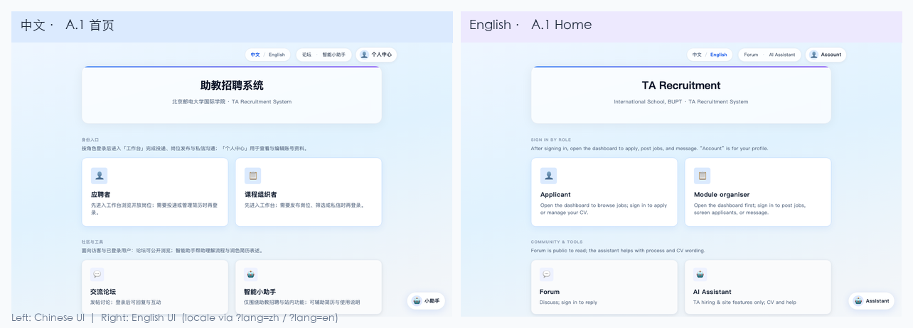

### 2.2 个人中心

统一入口 `/personal-center`：已登录用户按角色自动跳转至 TA / MO / 管理员工作台或个人页；未登录则选择身份并前往对应登录页。

**操作提示**

- 若已登录 TA，访问个人中心会进入 TA 相关页面，不会进入 MO 后台。
- 适合作为书签入口，省去记忆各角色路径。

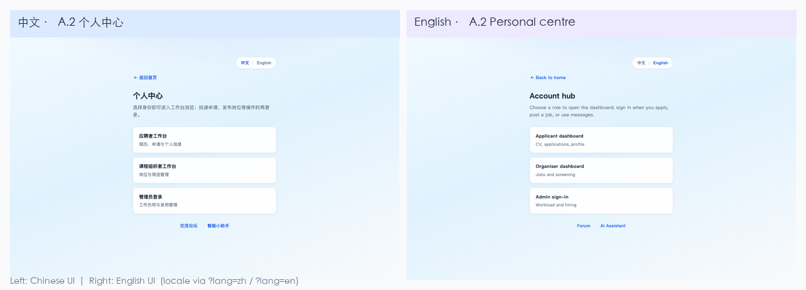

### 2.3 交流论坛（列表）

浏览帖子；**发帖、回复需登录**（TA / MO / Admin 均可参与）。适合分享招聘经验、课程安排、应聘心得等。

**操作提示**

- 支持**关键词搜索**、按时间/回复数等**排序**与分页浏览。
- 点击帖子标题进入详情页（见 §2.4）。
- 列表页可发起**发帖**；未登录时会引导至登录。
- 帖子与回复数据保存在 `data/forum_threads.json`、`forum_replies.json`。

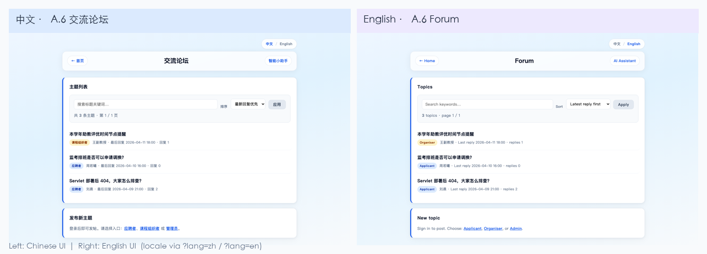

登录后页面底部可**发布新帖**（标题 + 正文）：

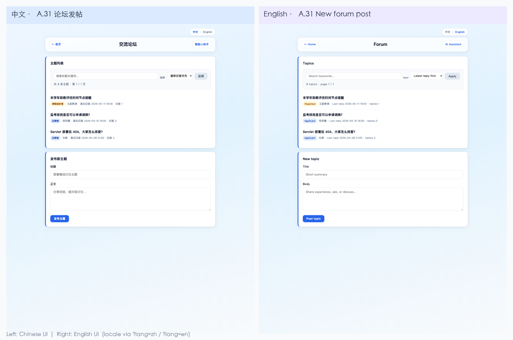

### 2.4 论坛帖子详情

路径：`/forum?threadId=...`。展示主帖正文、作者、回复列表；登录用户可在底部**发表回复**。

**说明**：帖子和回复的作者会显示角色（应聘者 / 课程组织者 / 管理员）及昵称，便于识别发言身份。

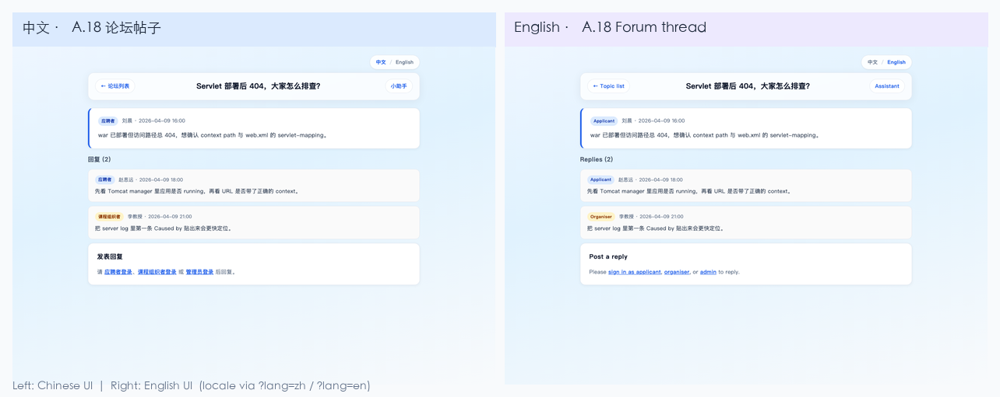

---

## 3. 应聘者 (TA)

### 3.1 登录与注册

| 页面 | 路径 |
|------|------|
| 登录 | `/ta/auth` |
| 注册 | `/ta/register.jsp`（也可从登录页进入） |
| 注册成功确认 | 注册提交后的确认页 |

**注册说明**：需填写姓名、学号、邮箱、密码及**技能标签**（如 Python、数据结构等）。技能标签将用于岗位匹配，建议如实填写并与简历内容一致。邮箱不可与已有账号重复。

**登录说明**：使用注册邮箱与密码登录；登录成功后可进入工作台。若从岗位页、小助手等被重定向而来，登录后将**回到原目标页面**。

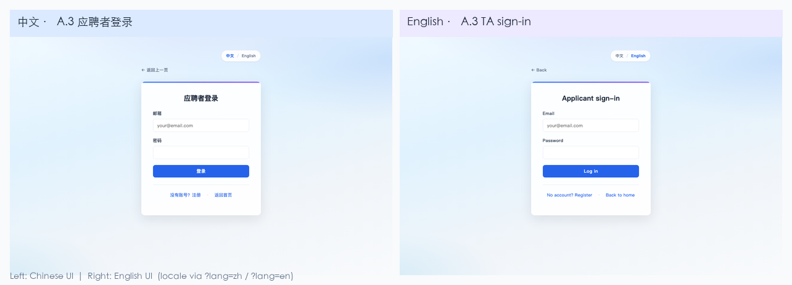

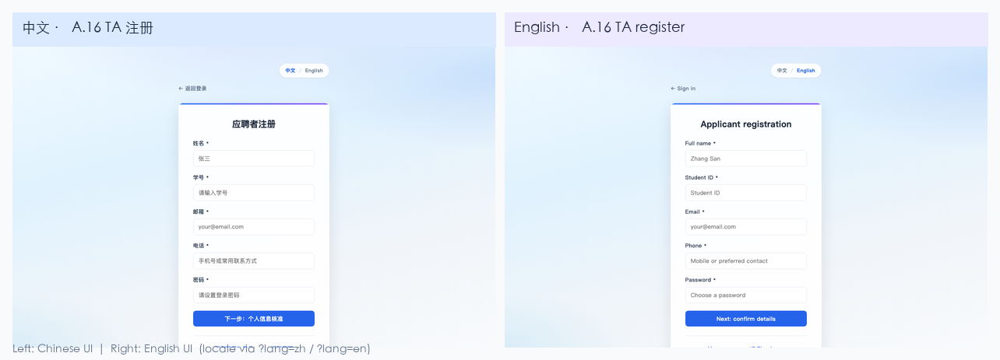

注册提交成功后的确认页：

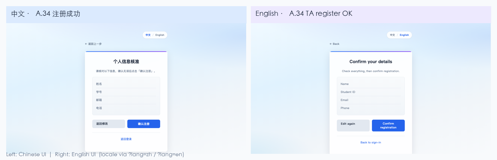

### 3.2 工作台 — 简历与技能

登录后进入 `/ta/dashboard`，顶部分栏包括：**简历**、**开放岗位**、**我的申请**、**消息**。

**简历分栏**

| 操作 | 说明 |
|------|------|
| 上传文件 | 支持 `.txt`、`.pdf`、`.doc`、`.docx`；系统抽取正文参与 MO 端匹配与 TA 端优劣势提示 |
| 编辑/粘贴文本 | 可编辑已保存的 txt 简历，或直接粘贴保存为文本简历 |
| 下载简历 | 通过 `/ta/resume` 下载本人已上传文件 |
| 匹配优势 / 短板 | 对照当前**所有开放岗位**所需技能，提示已覆盖与可加强方向 |
| **AI 修改简历** | 选择 Kimi / Qwen / OpenAI 模型，基于**已保存简历**对话润色；不自动写回文件，满意后请手动粘贴保存 |
| 技能标签 | 在 **个人中心**（§3.6）维护；与简历一并参与匹配 |

**建议**：申请前尽量完善简历与技能，以便在 MO 端获得更准确的匹配分与短板提示。AI 润色需部署方配置 API Key（见 §3.4）。

**匹配分如何计算（后台逻辑）**

系统为「应聘者 × 岗位」计算 **0–100 分**，并列出**技能短板**（岗位要求但尚未体现的技能）：

| 数据来源 | 用途 |
|----------|------|
| TA **技能标签** | 与岗位「所需技能」逐项比对 |
| **简历正文**（txt 直读；pdf/doc/docx 抽取） | 关键词规则识别是否出现所需技能 |
| 岗位 **requiredSkills** | 分母；为空时规则分为 100，短板为空 |

**规则分**（默认）：`规则分 = (已命中技能数 ÷ 岗位所需技能数) × 100`。已命中 = 技能标签中有 **或** 简历正文中识别到（支持中英文、忽略大小写）。

**语义分**（可选，默认关闭）：部署方在 `assistant.properties` 或环境变量开启 `match.semantic.enabled=true` 后，将 TA 与岗位文本生成 embeddings 向量并算相似度；结果缓存于 `data/embeddings.json`。与规则分融合时默认各占 50%；规则很低而语义很高时更信任语义（权重最高 80%）。未开启或 API 失败时仅用规则分。

简历分栏的「匹配优势 / 可加强方向」是对**当前所有开放岗位**所需技能的汇总提示，便于投递前补全材料。

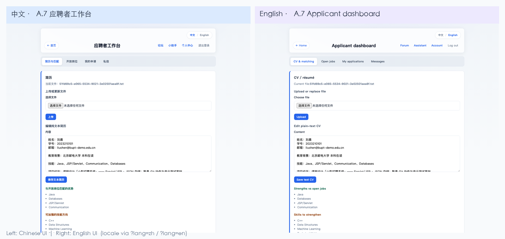

页面下方 **AI 修改简历** 区域（需已保存简历且配置 API Key）：

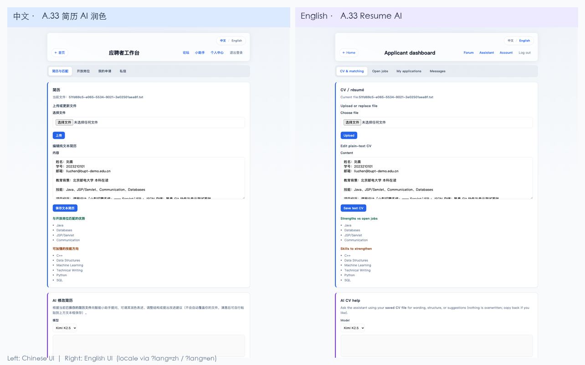

### 3.3 开放岗位与申请

**开放岗位** 分栏：浏览 MO 发布的开放岗位。

| 能力 | 说明 |
|------|------|
| 筛选 | 关键词、岗位类型（助教/监考/活动）、技能关键词、**隐藏已申请** |
| 排序 | 最新发布、匹配度从高到低等 |
| 匹配度 | 卡片展示 0–100 分（算法见 §3.2） |
| 申请 | 每岗位仅可申请一次，可填写申请说明 |
| 私信招聘方 | 对开放岗位可「联系 MO」（需满足沟通权限） |

未登录访客可浏览岗位列表，申请需登录（页面会提示登录后申请）：

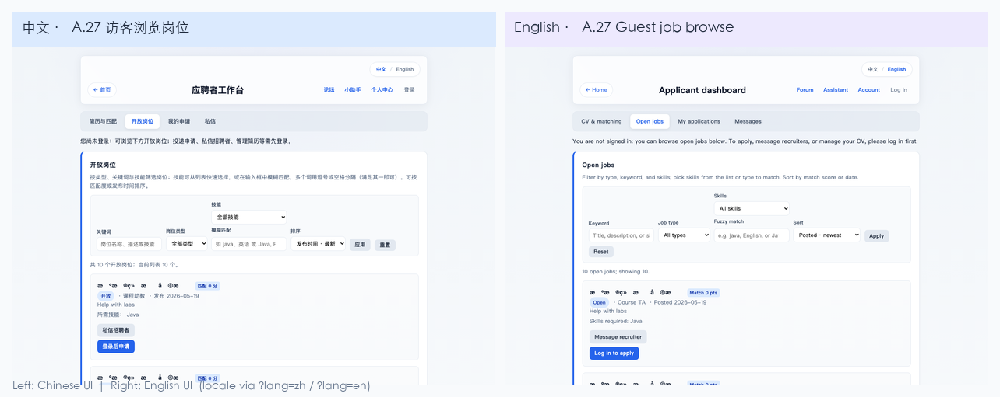

按 **匹配度从高到低** 排序示例（登录后）：

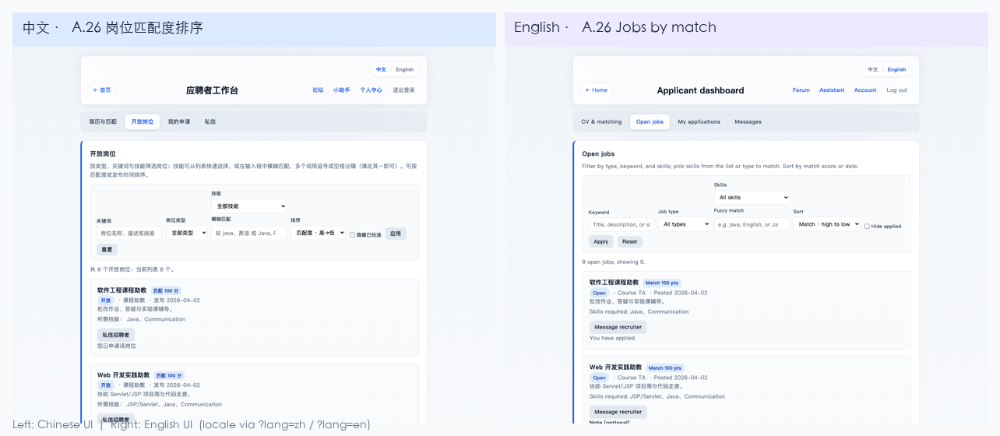

**我的申请** 分栏：查看已提交申请及当前状态；若 MO 已安排面试，可在此**确认参加**、**拒绝**或**申请改期**；待审核状态下可**撤销申请**。

**申请状态说明**

| 状态 | 含义 | TA 可执行操作 |
|------|------|----------------|
| 待审核 | 已提交，等待 MO 处理 | 可撤销申请 |
| 待面试 | MO 已安排面试时间/地点 | 可确认、拒绝或申请改期 |
| 已录用 | MO 已录用 | 查看结果 |
| 已拒绝 | MO 已拒绝 | 查看结果 |
| 已撤销 | 申请已取消 | — |

**状态流转**：MO 将申请设为「待面试」并填写时间地点后，TA 在本分栏确认/拒绝/改期；MO 可录用或拒绝；待审核时 TA 可撤销。管理员取消录用也会将申请置为已撤销并可能重新开放岗位。

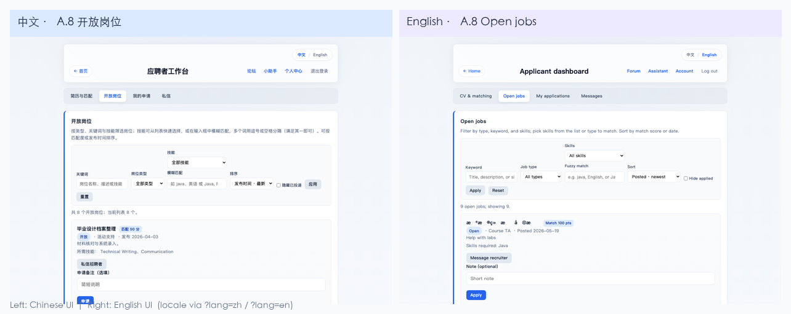

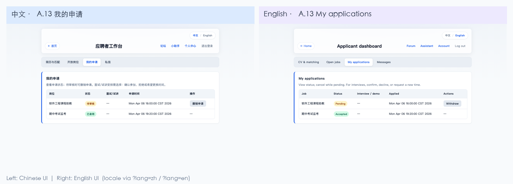

### 3.4 智能小助手

路径：`/assistant`（建议登录后使用，以便使用站内简历与额度账户）。

| 能力 | 说明 |
|------|------|
| 多轮对话 | 选择 Kimi / Qwen / OpenAI 等模型（取决于部署配置） |
| 简历上下文 | 粘贴文本、上传文件抽取、或使用**站内已保存简历** |
| 提问范围 | 默认仅回答与本招聘系统/应聘相关的问题，无关问题会拒答 |
| 额度 | 每月免费次数 + 付费点数；用尽后返回 402 并提示充值 |
| 充值 | 兑换码充值；配置微信商户时可 **Native 扫码支付** |
| 简历抽取 API | `/api/assistant/extract-resume` 解析上传文件供对话使用 |

若未配置 API Key，页面提示助手未就绪，**招聘主流程不受影响**。

**说明**：小助手对话**不参与**默认岗位匹配分计算（若开启语义匹配，则使用独立的 Embeddings 接口，与对话模型可同源）。

**运维配置**（可选）：`KIMI_API_KEY`、`QWEN_API_KEY`、`OPENAI_API_KEY`、`assistant.strict.scope`（是否限制非本系统话题）、`match.semantic.enabled` 等，详见 [README.md](../README.md)。

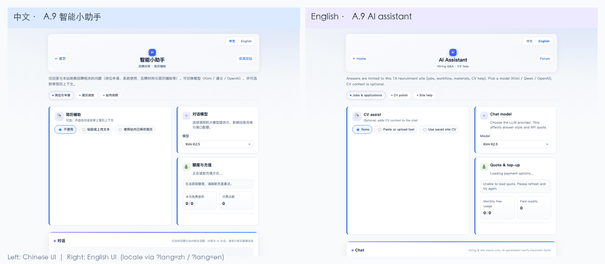

### 3.5 站内信与好友

工作台 **消息** 分栏：与 MO **私信**；左侧为会话列表，右侧为当前会话消息气泡；支持**未读角标**。

| 能力 | 说明 |
|------|------|
| 发起会话 | 从消息页选择 MO，或从岗位列表「联系招聘方」进入 |
| 好友请求 | MO 可向 TA 发送好友请求；TA 在消息分栏**接受**后便于长期私信 |
| 已读状态 | 未读条数显示在导航与列表项上 |

**使用场景**：咨询岗位要求、确认面试细节、录用后续沟通等。

私信与已读记录存于 `data/messages.json`、`dm_read_states.json`；好友关系存于 `friend_requests.json`、`friend_links.json`。

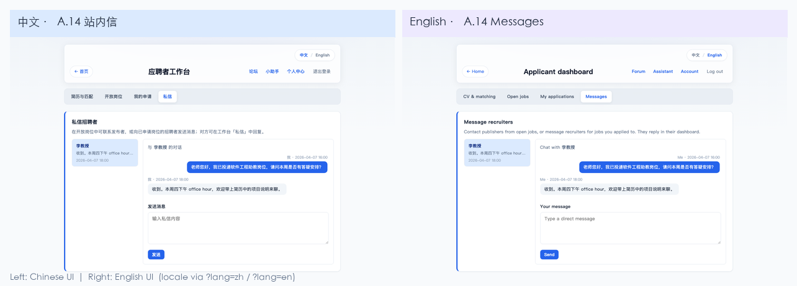

### 3.6 TA 个人中心

路径：`/ta/profile`（页眉「个人中心」）。与工作台分工：**此处维护账号资料**，岗位/简历/申请/消息在工作台处理。

| 内容 | 说明 |
|------|------|
| 资料概览 | 头像首字母、姓名、邮箱、学号、手机、简历状态 |
| 完整度 | 根据姓名、学号、手机、技能、简历五项计算百分比 |
| 编辑资料 | 修改姓名、学号、手机、技能标签（逗号分隔） |
| 快捷入口 | 跳转工作台各分栏（岗位、申请、简历、消息） |

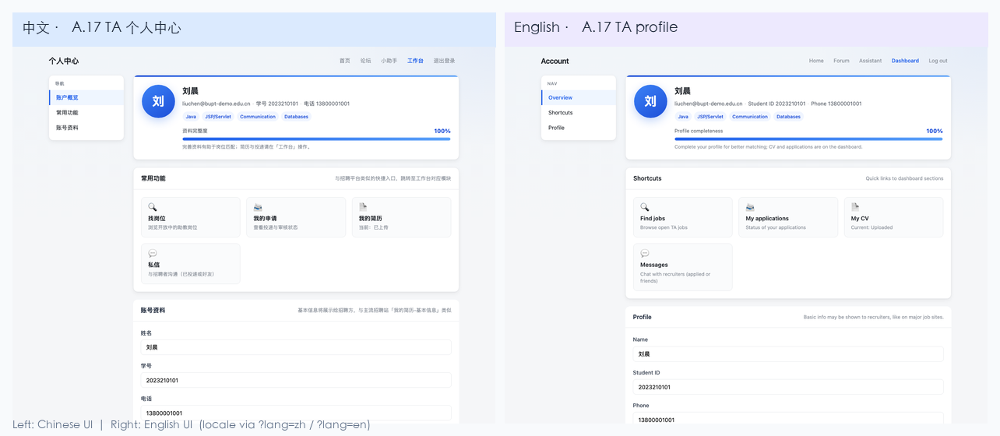

侧栏进入 **编辑资料** 可修改姓名、学号、手机与技能标签：

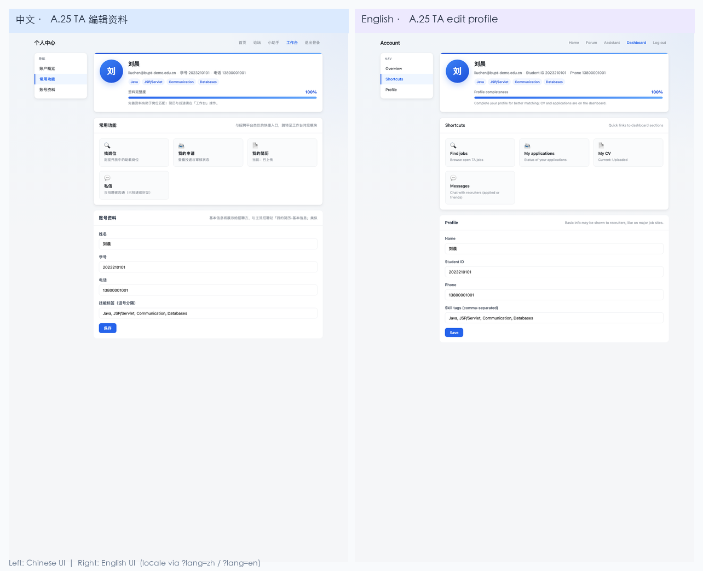

---

## 4. 课程组织者 (MO)

### 4.1 登录与注册

| 页面 | 路径 |
|------|------|
| 登录 | `/mo/auth` |
| 注册 | `/mo/register.jsp` |

**MO 会话与 TA、管理员相互独立**；切换角色前请先退出。

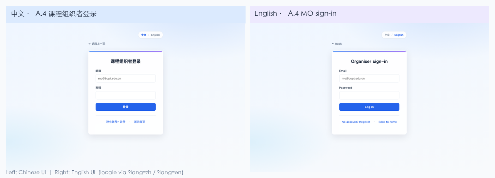

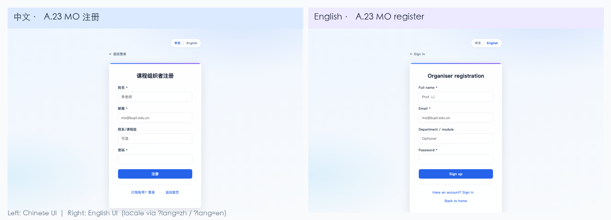

### 4.2 工作台 · 我的岗位

登录后 `/mo/dashboard`，顶部分栏：**我的岗位**、**发布岗位**、**消息**。

**我的岗位**分栏：表格列出已发布岗位及类型、开放/关闭状态。

| 操作 | 说明 |
|------|------|
| 编辑 | 修改进行中（开放）岗位的英文标题、描述、技能等 |
| 筛选应聘者 | 进入该岗位的应聘者列表（§4.4） |
| 关闭岗位 | 确认后关闭，TA 通常无法再新申请 |

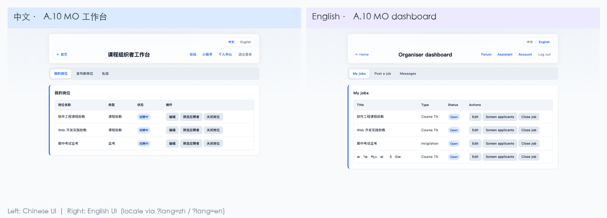

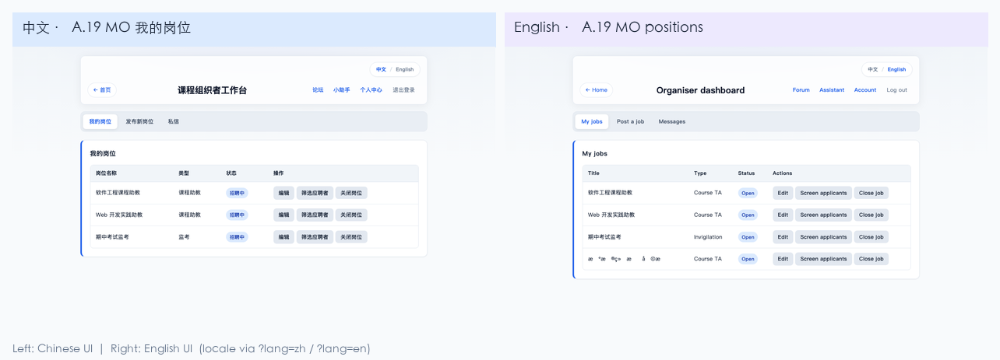

### 4.3 发布岗位

**发布岗位** 分栏：填写岗位名称、**类型**（课程助教 / 监考 / 活动等）、描述及**所需技能**（建议明确列出，便于系统计算匹配分与短板）。

**英文书写要求**

- 页面顶部提示：**岗位名称、描述与所需技能须全部使用英文填写**。
- 点击「发布」后先弹出**发布前确认**对话框，核对无误后提交。
- 若标题、描述或技能中含中文、日文、韩文、西里尔文、阿拉伯文等非英文字符，系统会**拦截提交**并弹出「无法发布」提示，需改为英文后重新提交。

**校验规则（前后端双重）**

将「名称 + 描述 + 技能」拼接后扫描字符：若含 CJK 汉字、韩文、日文假名、西里尔文、阿拉伯文等，则视为非英文并拒绝保存。纯英文、数字与常见标点可通过（技能示例：`Java, Python, invigilation`）。

| 环节 | 行为 |
|------|------|
| 浏览器脚本 | 「确认发布」提交前检测，含非英文则弹窗「无法发布」 |
| 服务端 | `createJob` / `updateJob` 再次校验，防止绕过前端 |

> **注意**：系统**不会**自动翻译；请 MO 自行用英文撰写。对内中文说明可放在论坛、私信等渠道。

点击「发布」后先弹出**发布前确认**对话框：

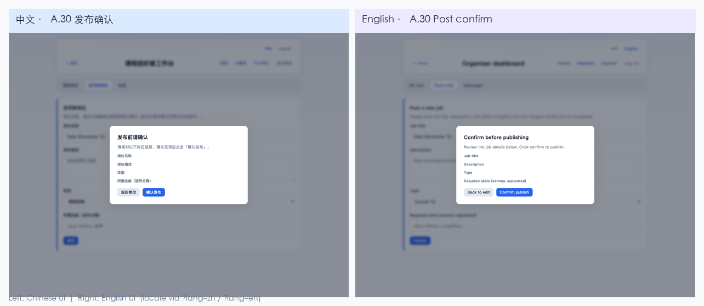

若填写中文等非英文字符，将弹出**无法发布**提示（或服务端返回错误横幅）：

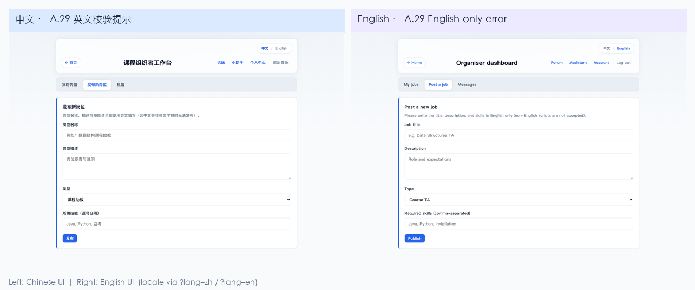

**其他说明**

- 发布后，状态为「开放」的岗位会出现在 TA 的「开放岗位」列表中。
- 编辑进行中的岗位时，同样适用英文校验规则（见 §4.4 编辑岗位）。

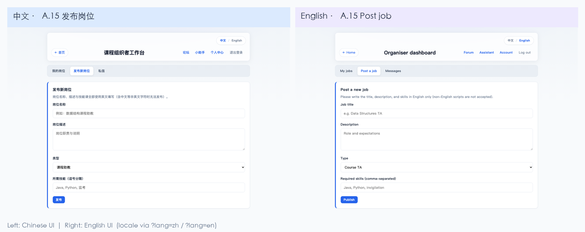

### 4.4 编辑岗位

路径：`/mo/dashboard?tab=edit&jobId=...`（从「我的岗位」进入）。仅 **开放中** 的岗位可编辑；字段与发布相同，**英文校验规则与 §4.3 一致**。

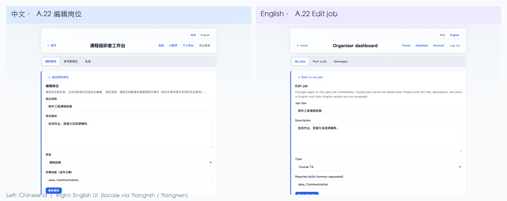

### 4.5 MO 站内信

工作台 **消息** 分栏：与 TA 私信；可查看会话、未读数；结合岗位申请或好友关系发起沟通。

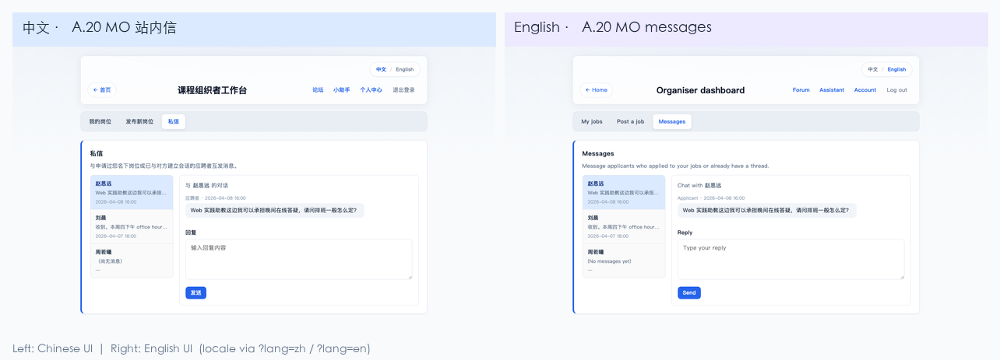

### 4.6 MO 个人中心

路径：`/mo/profile`。维护课程组织者姓名、邮箱等资料。

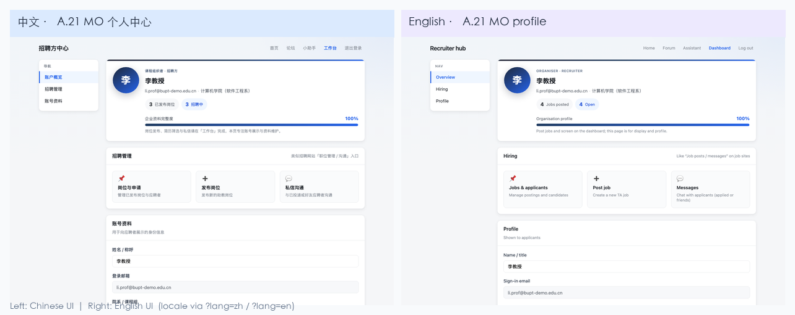

### 4.7 应聘者列表与匹配

对某一岗位打开 **应聘者列表**（`/mo/job-applicants?jobId=...`）。

**界面说明**

| 信息项 | 说明 |
|--------|------|
| **匹配分** | 综合 TA 技能与简历相对岗位所需技能的契合程度，分数越高越匹配 |
| **已匹配技能** | 岗位要求的技能中，候选人已具备的部分 |
| **技能短板** | 岗位要求但候选人简历/技能中未体现的部分，供筛选参考 |

**可执行操作**

| 操作 | 说明 |
|------|------|
| **安排面试** | 填写日期时间与地点/线上链接；申请状态变为「待面试」 |
| **重新安排** | 对已处于面试中的申请更新时间地点 |
| **录用** | 确认后状态为已录用，计入管理员工作负荷 |
| **拒绝** | 拒绝申请 |
| **筛选** | 按申请状态（待审核/面试/录用等）过滤列表 |
| **排序** | 匹配分高低、申请时间、姓名等 |

> **提示**：若岗位未设置所需技能，匹配分可能为满分而短板为空，请结合简历与申请说明人工判断。

**匹配分说明**：算法与 TA 端一致（§3.2），综合技能标签与简历正文；可选语义匹配由部署方开启。

**列表统计**（申请人较多时）：展示匹配分平均值、中位数、最高/最低、分数段人数，以及常见技能短板/优势 Top 列表。

**推荐排序**：默认按匹配分降序；**同分时优先展示当前已录用岗位较少的 TA**（负荷均衡），避免个别学生被连续录用过多。

对**待审核**申请人可展开 **安排面试**，填写时间与地点/链接：

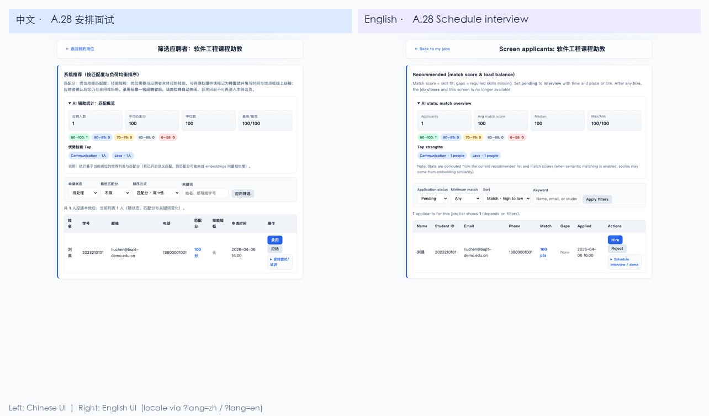

应聘者列表总览（匹配分、统计、筛选）：

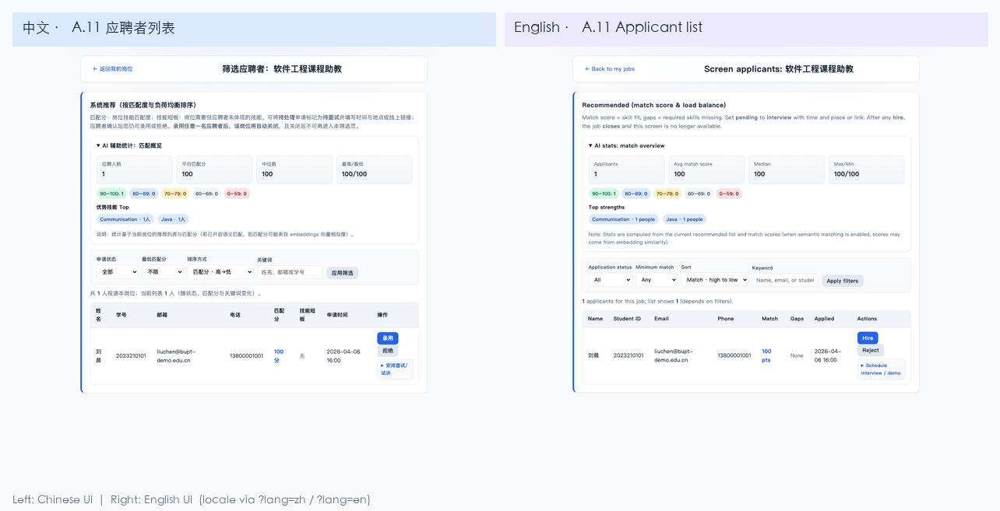

---

## 5. 管理员

### 5.1 登录与注册

| 页面 | 路径 |
|------|------|
| 登录 | `/admin/auth` |
| 注册 | `/admin/register.jsp` |

管理员**不能**代替 TA 申请或 MO 发岗，仅负责全局录用与工作负荷管理。

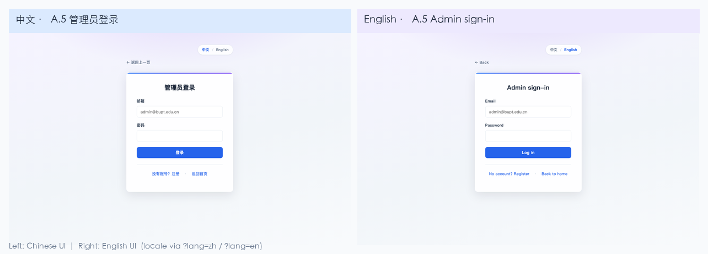

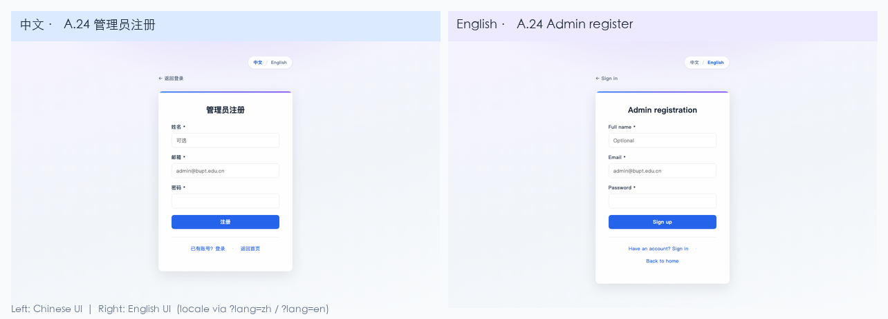

### 5.2 工作负荷总览

路径：`/admin/workload`。

**页面说明**

- 汇总每位 TA 当前**已录用**岗位数量，并显示人均、最高、最低等统计值。
- 对明显高于或低于平均的 TA 给出**偏高 / 偏低**提示，便于发现分配不均。
- 可展开查看某位 TA 的具体录用岗位列表。

**操作说明**：若需调整分配，可使用**转移录用**等功能（具体操作前请与 TA、MO 沟通确认）。本系统为教学演示环境，生产使用需补充审批与审计流程。

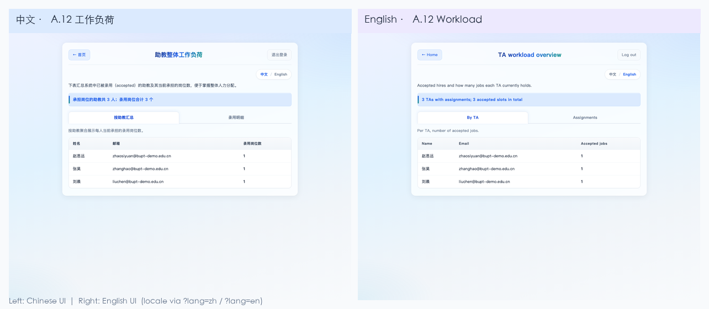

切换至 **录用明细** 标签可查看每位 TA 的具体录用岗位，并执行取消录用：

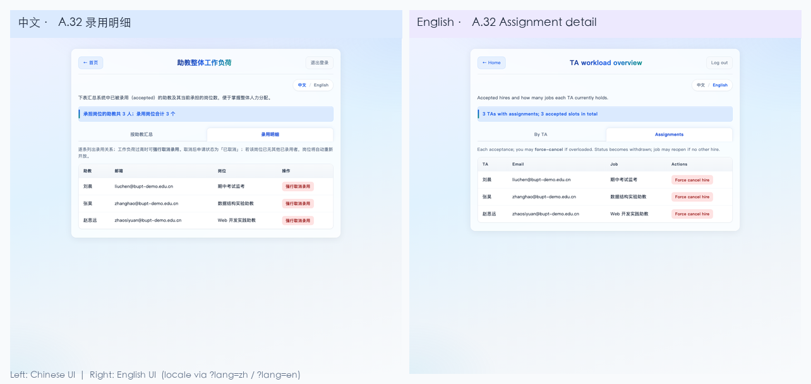

---

## 6. 常见问题

| 问题 | 说明 |
|------|------|
| 登录后跳错角色 | 同一浏览器勿混用 TA/MO/Admin 会话；请先**退出**再切换角色登录。 |
| 申请按钮不可用 | 可能已申请过该岗位、岗位已关闭，或未登录。 |
| 匹配分为 100 但仍有短板 | 岗位未设置所需技能时规则分可能为 100；短板列表可能为空，请人工查看简历。 |
| 发布岗位提示「不是英文」 | 标题/描述/技能中含中文等字符；请改为英文后提交（系统不自动翻译，见 §4.3）。 |
| 简历已上传但匹配度偏低 | 确认岗位所需技能为英文且与简历用语一致；补充技能标签或改简历关键词。 |
| 开启语义匹配后变慢 | 首次需调外部 API 并写缓存；后续同内容命中 `data/embeddings.json` 会更快。 |
| 面试安排后 TA 无响应 | 提醒 TA 在「我的申请」中确认；MO 可在应聘者列表查看 TA 反馈状态。 |
| 小助手无响应 | 检查 `assistant.properties` 或环境变量中的 API Key；未配置时仅招聘功能可用。 |
| 英文界面乱码或缺翻译 | 确认 URL 或 Cookie 语言为 `en`；部分专有名词可能保留中文。 |
| 数据丢失 | 本系统使用本地 JSON 文件存储，请勿删除部署目录下的 `data/` 文件夹。 |
| 论坛无法发帖 | 需先登录；检查部署目录 `data/` 下论坛 JSON 是否可写。 |
| 无法接受好友请求 | 在 TA「消息」分栏查看 MO 发来的待处理好友请求。 |

---

## 7. 相关文档

| 文档 | 说明 |
|------|------|
| [README.md](../README.md) | 环境搭建、配置、运行 |
| [test/测试用例说明.md](../test/测试用例说明.md) | 手工测试范围摘要 |
| [PRD.md](PRD.md) | 产品需求与功能边界 |
| `test/java/` | JUnit 自动化单元测试 |
| `target/site/apidocs/` | 运行 `mvn javadoc:javadoc` 后的 API 文档 |

---

## 附录：截图与文档维护

| 步骤 | 命令 / 说明 |
|------|-------------|
| 1. 启动应用 | `mvn tomcat7:run` |
| 2. 抓取中英文截图 | `python3 docs/capture_ui_screenshots.py` → `docs/report_ui/zh`、`en` |
| 3. 合成并排图 | `bash docs/prepare_user_manual_images.sh` → `docs/user_manual/bilingual/` |
| 4. 导出 Word | `cd docs && pandoc UserManual.md -o ../助教招聘系统_用户手册.docx --resource-path=".:user_manual/bilingual"` |

*本手册共 34 张截图（`01`–`34`）。若界面有更新，请按上表重新生成后导出。*
